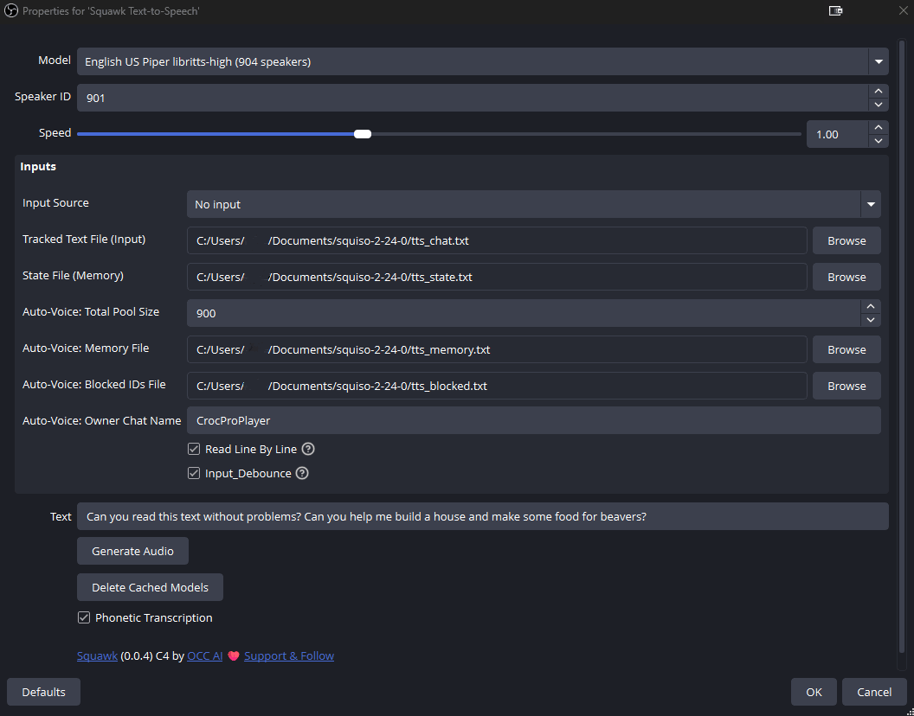

# OBS Squawk Croc

Local text-to-speech audio source for OBS Studio, forked from [obs-squawk](https://github.com/royshil/obs-squawk) and updated for a live streaming setup.

<div align="center">

[](https://github.com/croc-pro-dev/obs-squawk-croc/blob/master/LICENSE)
[](https://github.com/croc-pro-dev/obs-squawk-croc/releases)

</div>

This is a fork of the original obs-squawk plugin. I have updated the source code to improve stability and functionality for my streaming setup.

The plugin generates speech inside OBS with [sherpa-onnx](https://github.com/k2-fsa/sherpa-onnx). No external TTS service or network is required at generation time (models are downloaded when you pick a voice).

See [CHANGELOG.md](CHANGELOG.md) for the full list of features and fixes added in this fork.

<div align="center">
    <a href="https://www.youtube.com/watch?v=xE41VQjTruA" target="_blank">
        <br/>
        Original 3 Minute Tutorial
    </a>
</div>

## Key Improvements & Fixes

These changes are relative to the original [obs-squawk](https://github.com/royshil/obs-squawk) plugin.

### Persistent File Tracking

The original plugin re-read the entire input file every time a change was detected. This fork uses a state-tracking system with a second text file that stores a byte offset, so only new content is read and processed.

Set both paths in the source properties:

- **Tracked Text File (Input)** — the log or chat file to follow
- **State File (Memory)** — stores the last read byte offset (one number)

If the tracked file shrinks (for example after a log rotate), the offset resets to zero. File tracking does nothing until both paths are set.

**The tracked chat file is emptied every time OBS is opened.** When OBS starts, the Squawk source is created again: the tracked text file is truncated to empty, and the state file is reset to `0`. The same wipe happens if you add the source to a scene. Previous session lines are discarded on purpose so old chat is not spoken again.

### Audio Stability

Resolved robotic and distorted audio issues that occurred during OBS monitoring. The audio sample pushing logic was refactored to better align with the OBS audio thread: 20 ms chunks, continuous timestamps, and no idle silence frames. Playback is clean and smooth.

### Auto-Voice Assignment

Dynamically assigns a TTS speaker ID to each chat viewer from a limited pool, and remembers the mapping across lines.

- **Auto-Voice: Total Pool Size** — how many speaker IDs (0 .. N-1) may be handed out. `0` disables auto-voice.
- **Auto-Voice: Memory File** — `viewer_name speaker_id` per line. Required for auto-voice.
- **Auto-Voice: Blocked IDs File** — speaker IDs that must never be assigned (one integer per token).
- **Auto-Voice: Owner Chat Name** — the streamer name. The owner always uses the default **Speaker ID** and is not written to the memory file.

Input lines are parsed as `ViewerName: message`. Lines without a colon, or any line when auto-voice is disabled/unconfigured, use the default Speaker ID (bypass mode).

Owner-only commands (the line must come from the owner name):

| Command | Effect |
|---|---|
| `!change Name` | Assign `Name` a new unused (or random) pool voice and speak the source **Text** field with that voice |
| `!delete Name` | Remove `Name` from the memory file |

### Other stability fixes

- Empty path/text fields no longer crash OBS (`std::logic_error` from constructing `std::string` on a null `obs_data_get_string` result).
- Phonetic transcription now matches standalone letters (the original regex did not escape `\b`).
- Generate Audio / Delete Cached Models buttons use the current OBS `obs_properties_add_button2` API.
- Windows build updated for Visual Studio 18 2026, Qt 6, and vcpkg LibArchive.

## Features

- **OBS Audio Source**: Integrates with OBS as an audio source.
- **Sherpa-onnx**: Uses [sherpa-onnx](https://github.com/k2-fsa/sherpa-onnx/) for on-device voice synthesis. No extra runtime besides the plugin.
- **Cross-Platform sources**: Original project targeted Windows, macOS, and Linux. This fork is actively used and built on Windows.
- **Voice library**: Pre-trained voices for many languages, downloaded on demand.
- **OBS text source monitoring**: When an OBS text source changes, speech is generated (with optional line-by-line and debounce).
- **Append-only file monitoring**: Track a growing text file without re-speaking old content.
- **Session reset of the chat file**: The tracked chat file is emptied every time OBS opens, so a new stream starts from a clean log.
- **Auto-Voice for chat**: Persistent per-viewer speaker IDs from a pool, with owner override and blocklist.
- **Real-Time & Lightweight**: VITS generation on CPU.

## Installation

1. Download the latest release from this repo’s [Releases](https://github.com/croc-pro-dev/obs-squawk-croc/releases) page, or build from source (see [Building](#building)).
2. Run the installer, or copy the plugin files into your OBS plugins directory.
3. Restart OBS.

If no release asset is published yet, build with the Windows instructions below and copy `obs-squawk.dll` plus its dependent DLLs into OBS.

## Usage

1. In OBS, add a source and choose **Squawk Text-to-Speech**.
2. Choose a **Model**. The first time, the voice package is downloaded.
3. Set **Speaker ID** (some models have many speakers) and **Speed**.
4. Optional: type text and click **Generate Audio** to test.
5. Drive speech from one or both of:
   - An OBS **Input Source** (text source) — original behavior, with Line By Line and Input Debounce.
   - A **Tracked Text File** plus **State File** — append-only log / chat file.



### File-tracking setup

1. Create two empty `.txt` files, for example `chat.txt` and `chat_offset.txt`.
2. Point **Tracked Text File (Input)** at `chat.txt` and **State File (Memory)** at `chat_offset.txt`.
3. Have your chat bot or overlay **append** lines to `chat.txt` (do not rewrite the whole file unless you intend to reset).

**Warning:** every time you open OBS, `chat.txt` is emptied and `chat_offset.txt` is reset to `0`. Anything still in the file from the previous session is deleted. Your chat logger must keep writing new lines after OBS is already running.

Chat-style lines for auto-voice:

```text
Alice: Hello everyone
Bob: First time here
StreamerName: !change Alice
```

### Auto-Voice setup

1. Set **Total Pool Size** to the number of speaker IDs you want to hand out (must be greater than 0).
2. Point **Memory File** at a writable `.txt` file.
3. Optionally point **Blocked IDs File** at a file listing IDs to skip.
4. Set **Owner Chat Name** to your exact chat nick so your lines always use the default Speaker ID.

If pool size is 0 or the memory file is unset, every tracked line is spoken with the default Speaker ID.

The auto-voice memory file is **not** cleared when OBS opens. Viewer-to-voice assignments persist across sessions.

### Voice Training

Instructions on how to train a custom voice model are not included in this fork.

### Models

The plugin lists the [sherpa-onnx TTS models](https://github.com/k2-fsa/sherpa-onnx/releases/tag/tts-models).

## Building

### Windows (this fork)

This fork is built with Visual Studio 18 2026, Qt 6, vcpkg, and a local OBS Studio tree.

```powershell
cmake --preset windows-x64
cmake --build --preset windows-x64
```

The original helper script still exists:

```powershell
.github/scripts/Build-Windows.ps1 -Configuration Release
```

Install by copying the built plugin into OBS, for example:

```powershell
Copy-Item -Recurse -Force "release\Release\*" -Destination "C:\Program Files\obs-studio\"
```

If you built into `build\Release`, copy `obs-squawk.dll` and the required runtime DLLs (`archive.dll`, `bz2.dll`, `libcrypto-3-x64.dll`, `liblzma.dll`, `lz4.dll`, `z.dll`, `zstd.dll`, plus sherpa-onnx / ONNX Runtime DLLs from the build tree) into the OBS `obs-plugins\64bit` folder, and copy `data\` into the matching OBS plugin data path.

`CMakeLists.txt` / `CMakePresets.json` currently contain machine-local OBS and Qt paths (`C:/dev/obs-studio`, `VCPKG_ROOT`). Adjust those for your machine before configuring.

### Mac OSX

```sh
./.github/scripts/build-macos -c Release
```

Copy `obs-squawk.plugin` from `./release/Release` to `~/Library/Application Support/obs-studio/plugins`.

```sh
./.github/scripts/package-macos -c Release
```

### Linux (Ubuntu)

```sh
sudo apt install -y libssl-dev libarchive-dev libbzip2-dev
./.github/scripts/build-linux
sudo cp -R release/RelWithDebInfo/lib/* /usr/lib/
sudo cp -R release/RelWithDebInfo/share/* /usr/share/
```

Or copy into `~/.config/obs-studio/plugins/obs-squawk/` as described in the original plugin docs.

## License

GPLv2 — see [LICENSE](LICENSE). Original work by Roy Shilkrot / OCC AI; fork changes by croc-pro-dev (2026).

## Acknowledgements

- [obs-squawk](https://github.com/royshil/obs-squawk) — original plugin.
- [sherpa-onnx](https://github.com/k2-fsa/sherpa-onnx) — on-device TTS and pretrained models.
